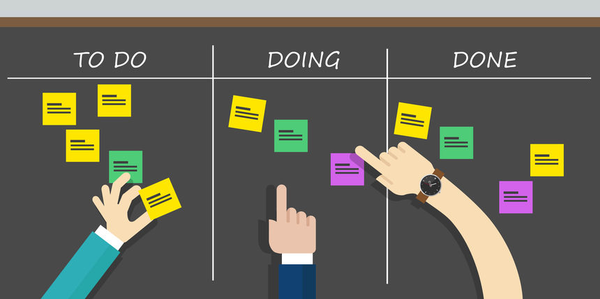

# Projektmanagement-Methode

## Kanban

Kanban ist eine agile Projektmanagement-Methode, die auf der Visualisierung von Arbeitsabläufen basiert. Es handelt sich um ein System von Karten, die die Arbeit darstellen, die zu erledigen sind, sowie den Fortschritt, der bereits gemacht wurde. Kanban ermöglicht es Teams, ihre Arbeit zu organisieren, zu visualisieren und zu optimieren, indem es den Fokus auf die Steuerung des Workflows und die Vermeidung von Überlastung legt.

Kanban-Boards zeigen den aktuellen Stand der Arbeit an und helfen, den Arbeitsfluss zu verbessern, indem sie Engpässe aufdecken und Verbesserungspotential aufzeigen. Kanban fördert auch die Zusammenarbeit im Team und die kontinuierliche Verbesserung des Arbeitsprozesses.
Kanban kann auch sehr gut für kleine Projekte an welchen nur eine Person arbeitet verwendet werden.

[Quelle](../Quellenverzeichnis/index.md#kanban-board)
## Scrum

Scrum ist ein Rahmenwerk für eine spezifische Methode des Projektmanagements. Es zeichnet sich durch effiziente Prozesse, schrittweise Entwicklung und regelmäßige Feedbackschleifen aus. Obwohl es ursprünglich hauptsächlich in der Softwareentwicklung angewendet wurde, findet es mittlerweile breite Anwendung in verschiedenen Branchen.

Im Fokus von Scrum steht ein inkrementeller, iterativer Ansatz. Durch aufeinanderfolgende, eigenständige Phasen (Sprints) werden unterschiedliche Versionen eines Produkts erstellt. Diese Sprints werden fortlaufend wiederholt, bis ein zufriedenstellendes, vollständiges Produkt entsteht.

[Quelle](../Quellenverzeichnis/index.md#scrum-methode)
## Kanban und Scrum in meiner Semesterarbeit

Während meiner Semesterarbeit werde ich mit der Projektmanagement-Methode *Kanban* und *Scrum* arbeiten. Kanban ist in Github bereits integriert, in welchen man Boards und Tasks selbst erstellen kann. So habe ich in Form von "Issues" meine Arbeiten, welche zu erledigen sind, aufgelistet. Mit Kanban kann ich sehr effizient arbeiten und sehe stetig meine Fortschritte. Mittels der verschieden Stati, sehe ich, an welchen Themen ich gerade arbeite oder welche abgeschlossen wurden. 

In Github Projekts kann man für Kanban verschiedene Ansichten erstellen. So habe ich verschiedene Gantt-Diagramme erstellt, in welchen man den ganzen Projektfortschritt verfolgen und überprüfen kann. Um die Arbeit voranzutreiben, werde ich Scrum-Sprints arbeiten, welche auch Voraussetzungen der Semesterarbeit sind, womit ich meine Zwischenziele auswerten und reflektieren kann. Während der Semesterarbeit gibt es insgesamt 3 Sprints.

Hier findet man den Link zu meinem Projektmanagement:

[4. Semester Arbeit Orchestrierung eines Geschäftsprozesses mit Kubernetes, CI/CD und Camunda BPM](https://github.com/users/Bazzako/projects/6/views/2)

Da ich alleine an der Semesterarbeit arbeite, bin ich alle Scrum Rollen in einem, daher fallen auch die Daily Scrum's weg. 

