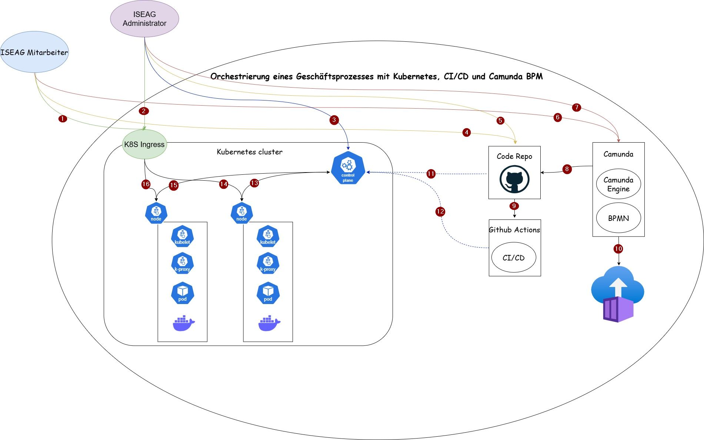

# SEUSAG

Um die Systemabgrenzungen zu veranschaulichen, habe ich ein SEUSAG erstellt. Somit werden Systemgrenzen geklärt, Einflussgrössen ermittelt, Unter - / Teilsysteme isoliert, Schnittstellen definiert, Analysen von Elementen - Dimensionen und Beziehungen erstellt und Gemeinsamkeiten erkannt.

[Hier](https://1drv.ms/i/c/77fe47fd6cd90d40/EYmO6-ZZNvJNoGeDwsYqIpkBvBcPYb1_Dc0fZyCxsUrwJg?e=2adIpF) kann das SEUSAG noch in einer besseren Qualität angesehen werden.

Hier werden die einzelnen Schnittstellen beschrieben. Die Nummerierung dient lediglich der Zuweisung und hat keinerlei Bedeutung für den Ablauf.

1. Externer Zugriff auf den POD (Zugriff auf das Camunda Dashboard mit den BPMN Prozessen)
2. Externer Zugriff auf den POD (Zugriff auf das Camunda Dashboard mit den BPMN Prozessen)
3. Zugriff auf den Controle Plane (Master Node)
4. Getägtigte Arbeiten werden auf das 4.Semesterarbeit Repository gepostet
5. Getägtigte Arbeiten werden auf das 4.Semesterarbeit Repository gepostet
6. Aufbereitung der Camunda BPMN Prozesse
7. Aufbereitung der Camunda BPMN Prozesse
8. Der Aufbereitete Camunda Prozess wird auf das 4.Semesterarbeit Repository gepostet
9. Konfigurieren einer CI/CD Pipeline mit Github Actions
10. Camunda Docker-Image
11. Kubernetes Umgebung wird gebaut, Camunda wird auf die Umgebung Deployed
12. Pipeline Deployment
13. Kommunikation zwischen Nodes und Controle Plane
14. Weiterleitung der Anfrage von extern an den Node (POD)
15. Kommunikation zwischen Nodes und Controle Plane
16. Weiterleitung der Anfrage von extern an den Node (POD)