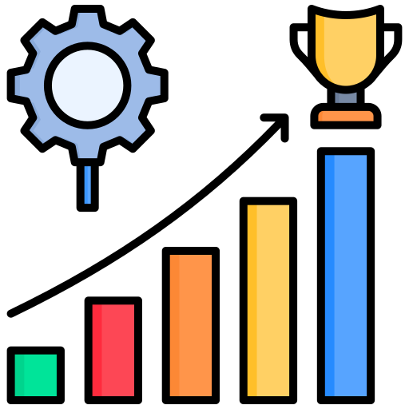

# Control Phase

Da ich mit der Qualitätsmanagementmethode *Lean Six Sigma* arbeite, werde ich Schritt für Schritt den *DMAIC* Zyklus durchgehen und somit den Prozess zu bearbeiten. 

Der fünfte Schritt dazu ist die *Control Phase*. Was in dieser Phase genau geschieht, wird in der Einleitung unter Punkt 2.5 Projektmanagement-Methode beschrieben.


{: width="250px" }

[Quelle](../Quellenverzeichnis/index.md#control)

Die *Control Phase* dient einer längeren Zeitperiode. Der angepasste Prozess wird so fortlaufen auf seine Nachhaltigkeit und Optimierungsmöglichkeit überprüft. 


### Playwright

Playwright ist ein modernes Open-Source-Testautomatisierungstool, das für End-to-End-Tests von Webanwendungen entwickelt wurde. Es ermöglicht dir, Webanwendungen in verschiedenen Browsern wie Chromium, Firefox und WebKit zu testen. Playwright wurde von Microsoft entwickelt und bietet zahlreiche Vorteile, die es ideal für die Automatisierung und Prüfung von Webanwendungen machen. Das tool lässt sich einfach in VS-Code integrieren und bietet die möglichkeit einen Testcase per Bildschirmaufnahme zu erstellen. In meinem Fall habe ich das Datenerfassung.form auf meiner Camundawebseite gestet. So sieht der generierte Case aus.

```
import { test, expect } from '@playwright/test';

test('Datenerfassung', async ({ page }) => {
  await page.goto('http://cloud-hf-14-w1:30000/camunda/app/welcome/default/#!/login');
  await page.getByPlaceholder('Username').fill('demo');
  await page.getByPlaceholder('Username').press('Tab');
  await page.getByPlaceholder('Password').fill('demo');
  await page.getByRole('button', { name: 'Log in' }).click();
  await page.locator('.tasklist-app > .app-label-wrapper').click();
  await page.getByRole('link', { name: ' Start process' }).click();
  await page.getByRole('link', { name: 'Garantiefallprozess' }).click();
  await page.reload();
  await page.getByRole('button', { name: 'Start' }).click();
  await page.getByRole('heading', { name: 'All Tasks' }).click();
  await page.locator('li').filter({ hasText: 'Gerätedaten erfassen Garantiefallprozess Created a few seconds ago' }).getByRole('link').click();
  await page.getByRole('button', { name: 'Claim' }).click();
  await page.getByLabel('DeviceModel Test').click();
  await page.getByLabel('DeviceModel Test').fill('Test1');
  await page.getByRole('button', { name: 'Complete' }).click();
});
```
Hier könnte man jetzt ansetzen und für jedes erstellte .form File eigene Test erstellen. Wichtig ist jedoch zu beachten, dass diese Test nach jeder Anpassung eines .form Files angepasst werden müssen.

Ich habe dafür in der Pipeline einen weiteren Job erstellt, welcher abhängig vom "Deploy" Job ist.
Damit diese Test in der Pipeline durchgeführt werden können, müssen auf dem Runner dependecies installiert werden.
```
    - name: Install dependencies
      run: |
        cd tests
        npm install
        echo "npx wird installiert"
        npx playwright install --with-deps
```
Beim testen der Pipeline habe ich schnell bemerkt, dass die Installation etwas an Ressourcen frisst, weshalb ich den Worker Nodes mehr Ressourcen geben musste. [Hier](../Abschluss/Erfahrungen.md#testing) mehr dazu. In einem weiteren Schritt könnte man die dependencies in einem pvc cachen, somit müssten diese  nicht immer aufs neue installiert werden und die Pipeline würde einiges schneller durchlaufen. Leider fehlte mir dafür die Zeit.