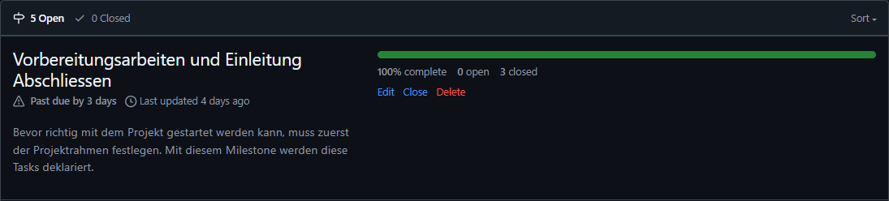
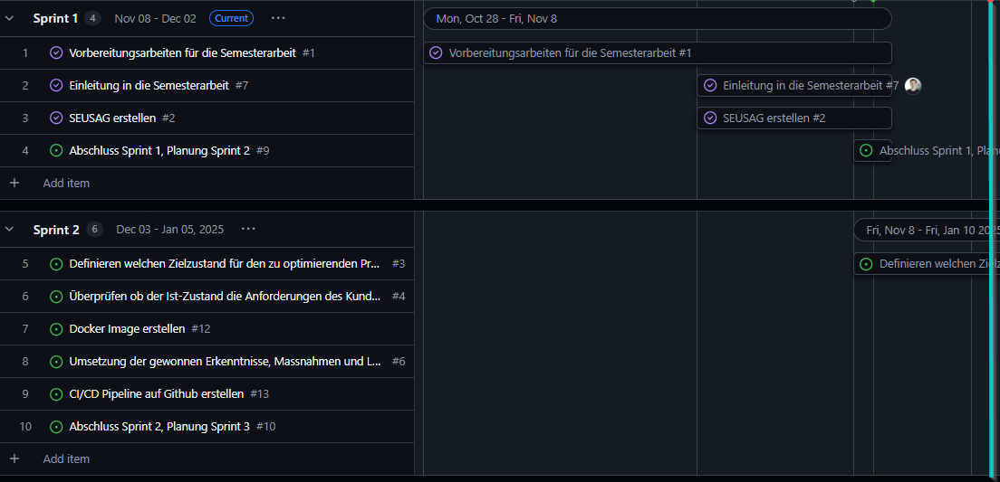
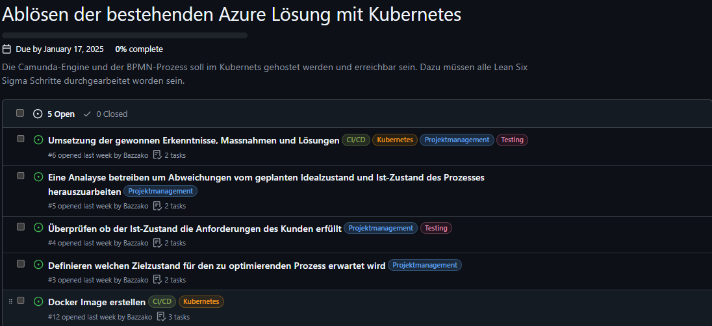

# 1. Sprintabschluss

Rückblicken auf den ersten Sprint kann ich sagen, dass ich im Zeitplan liege. Ich habe alle Vorbereitungsarbeiten für die Semesterarbeit abgeschlossen und kann jetzt mit der ersten Phase des *DMAIC-Zyklus* beginnne, dem *Define*.

[Milestones - 4. Semesterarbeit](https://github.com/Bazzako/SemArb4-CD-und-Camunda-BPM/milestones)

Im Gantt-Diagramm (Gantt Nach Sprints) sieht es aktuell wie folgt aus. Der blaue Strich visualisiert das Ende des 1.Sprints.

[Gantt Nach Sprints - 4. Semesterarbeit](https://github.com/users/Bazzako/projects/6/views/4)

## Wieso liege ich im Zeitplan?

Da ich die Dokumentation der 2.Semesterarbeit als Vorlage benutzen kann, konnte ich bald mit der Planung der Arbeit beginnen und meine Issues erfassen.

## Was ist mir gut gelaufen und was nicht ?

Die Eingabe der Semesterarbeit war diese Semester etwas holprig. Ich wusste anfangs nicht recht was ich umsetzen soll, da ich im 3.Semester mit Marco Kälin eine Arbeit geschrieben habe und diese sich nicht eignete um Sie für die 4. Semesterarbeit erneut zu verwenden. Ich habe mir dann gedankten gemacht, was ich für einen Service/App für die Arbeiten im 4. Semster verwenden könnte. Ich habe mir dann schlau gemacht, ob Camunda sich dafür eignen würde und habe mich entschlossen es zu versuchen. Die Zielsetzung der Arbeit war nicht gut genug, weshalb die Eingabe 2x nicht angemommen wurde. Nach Feedback von Marcel Bernet wurde die Eingabe in einer 3.Version dann aber angenommen.
Das Projektmanagmenet gelingt mir immer besser und liegt mir langsam gut.

## Blick auf den 2.Sprint

Ich freue mich wieder mit Lean Six Sigma arbeiten zu können und im 2.Sprint mit der Umsetzung der praktischern Arbeit zu starten.

Im 2.Sprint muss folgender Meilenstein vollenden werden.

