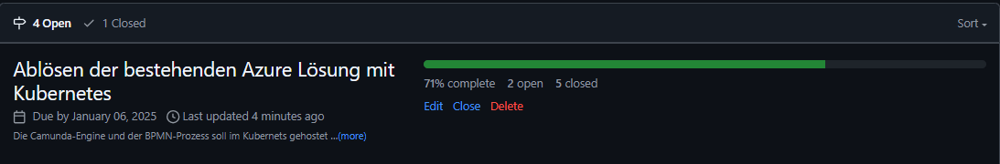
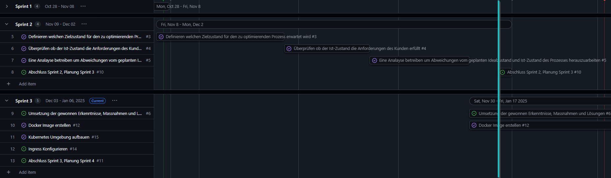
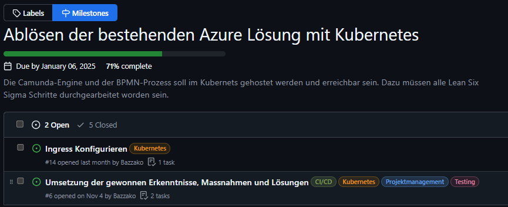

# 2. Sprintabschluss

Rückblicken auf den ersten Sprint kann ich sagen, dass ich im Zeitplan liege. Ich konnte mit der Umsetzung starten, bin jedoch bereits auf einige Komplikationen gestossen, welche zu bewältigen sind.

[Milestones - 4. Semesterarbeit](https://github.com/Bazzako/SemArb4-CD-und-Camunda-BPM/milestones)

Im Gantt-Diagramm (Gantt Nach Sprints) sieht es aktuell wie folgt aus. Der blaue Strich visualisiert das Ende des 2.Sprints.

[Gantt Nach Sprints - 4. Semesterarbeit](https://github.com/users/Bazzako/projects/6/views/4)

## Wie stehe ich im Zeitplan ?

Ich liege gut im Zeitplan, da ich die Phasen *Define* *Measure* und *Analyse* sehr schnell erledigen konnte, konnte ich schon früh mit dem *Improve* beginnen.

## Was ist mir gut gelaufen, worauf baue ich auf ?

Ich war am Ende des 1. Sprints sehr motiviert und konnte die 3 Phasen *Define* *Measure* und *Analyse* schnell umsetzen. Ich habe mich dann für das Umsetzen der praktischen Arbeit vorbereitet, recherchen betrieben und einige Tests gemacht. Ich habe aber relativ schnell festgestellt, dass die Umsetzung wie ich sie mir vorgestellt hatte, nicht so einfach umzusetzen ist. Das hat mir enorm die Motiviation genommen. Ich habe dann weiter Wege gefunden um Mein Ziel zu erreichen. Ich habe dann versucht auf eine bestehenden Kubernetes Cluster von Philipp Stark ein Helm Chart von Camunda aufzusetzen, wobei die Pods dann nicht sauber gestartet sind. Dass hat die Motiviation dann nochmals hinunter gedrückt. Dank Yves Wetter  konnte ich mit Terraform eine Kubernetes Umgebung auf dem MAAS von Marcel Bernet erstellen und werden versuchen den Helm Chart darauf anzuwenden.

## Blick auf den 3.Sprint

Ich muss wieder ein grösseres Erfolgserlebnis haben um meine Motivation für die Arbeit wieder zu stärken! Seitens Projektmanagement sieht es gut aus. Ich darf aber nicht unterschätzen, dass das Ende immer näher kommt und ich nicht stehen bleiben darf.

Im 3.Sprint muss folgender Meilenstein vollenden werden.

