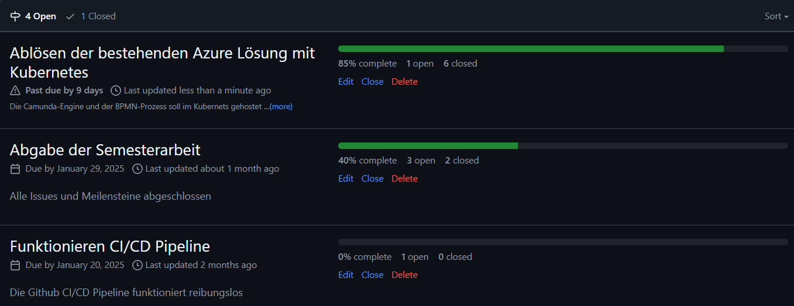
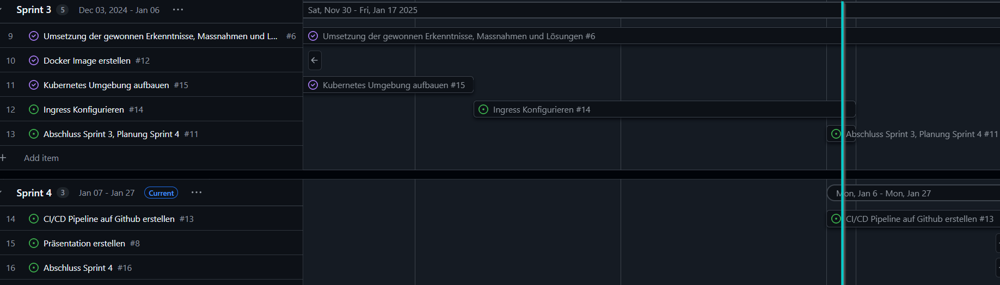

# 3. Sprintabschluss

Rückblicken auf den zweiten Sprint kann ich sagen, dass ich etwas im Verzug bin. Ich bin inmitten der Umsetzung und konnte einige Ziele bereits erfüllen. Ich habe jedoch ein Ziel welches wie es definiert ist, nicht erreicht werden kann. Ausserdem musste ich vom Zeitplan abweichen.

[Milestones - 4. Semesterarbeit](https://github.com/Bazzako/SemArb4-CD-und-Camunda-BPM/milestones)

Im Gantt-Diagramm (Gantt Nach Sprints) sieht es aktuell wie folgt aus. Der blaue Strich visualisiert das Ende des 3.Sprints.

[Gantt Nach Sprints - 4. Semesterarbeit](https://github.com/users/Bazzako/projects/6/views/4)

## Wie stehe ich im Zeitplan ?

ich bin leicht im Verzug. Ich musste weil ich die Prioritäten angepasst habe die Ingress-Controller Konfiguration nach hinten verschieben. Mir war es wichtiger, die Pipeline zum laufen zu bringen, was ich auch geschafft habe. Die ganze Projekt funktioniert auch ohne Ingress, weshalb ich diesen erst konfigurieren werde, sobald das Testing läuft. 

## Was ist mir gut gelaufen, worauf baue ich auf ?

Die Weinachtsferien haben mir, was das Projekt angeht, nicht gut getan. Ich habe eine Weinachtspause eingelegt, welches die Motiviation für die Arbeit enorm reduziert hat. Ich hätte stetig dran bleiben sollen. Dies hat nun auswirkungen darauf, dass ich etwas in Zeitdruck gerate. Die wichtigsten Aspekte des Projektes funktionieren jedoch. Ich muss mich jetzt unbedingt dran halten und mich auf meine noch nicht erreichten Ziele fokusieren. Einen erfolgreichen Abschluss schaffe ich nur, wenn ich jetzt regelmässig an dem Projekt arbeite.

## Blick auf den letzten Sprint

Ich darf jetzt nicht aufhören und muss am Ball bleiben !

Im letzten Sprint muss ich Arbeit beendet werden.